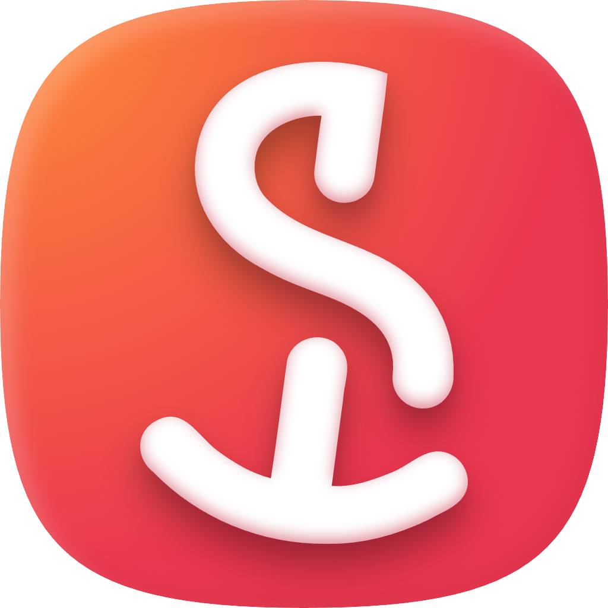

  
  <h1 align="center"><b>Projektwoche - Monorepo</b></h1>
  

   <strong>Monorepo for the project "Nachhaltige Webentwicklung" at the Project Week of the <a href="https://athenaeum-stade.de">Gymnasium Athenaeum Stade</a></strong>
    
   <a href="https://prowo.hackclub-stade.de"><strong>prowo.hackclub-stade.de »</strong></a>
  

 

  

  
   
  
  
  
   
  
  
  

## About the Monorepo

A monorepo for the project week "Nachhaltige Webentwicklung" at Gymnasium Athenaeum Stade, organized by Hackclub Stade in cooperation with the DJL Foundation.

## About the Project Week

The **project week "Nachhaltige Webentwicklung"** takes place at **Gymnasium Athenaeum Stade** (Harsefelder Straße 40, 21680 Stade, Lower Saxony) and is organized by **Hackclub Stade** under the DJL Foundation in cooperation with The Hack Foundation.

### Goals of the Project Week

The project is designed to introduce students to web development and to complete at least **two projects** within one week:

1. **Personal Website** - Each student creates their own website.
2. **Sustainability Project** - A website to concretize ideas on how IT/web/server technology can be made more sustainable.

All created websites will be published under the domain **[prowo.hackclub-stade.de](https://prowo.hackclub-stade.de)**.

### Lesson Plan

- **First 1.5 days**: HTML basics with the help of developed CLI tools.
- **Following days**: Workshops based on [webdev.hackclub.com](https://webdev.hackclub.com).
- **Final days**: Development of sustainability projects.

### Reward System

In cooperation with Hackclub, a reward system will be implemented using the **YSWS (You Ship We Ship)** program - students who successfully host their websites will receive a small reward.

## Repository Structure

This monorepo contains all tools and applications developed for the project week:

### 🌐 Web Applications (`/apps`)

- **`web/`** - Main website ([prowo.hackclub-stade.de](https://prowo.hackclub-stade.de))
  - Landing page with information about the project week.
  - Download page for the setup CLI (`/setup`).
  - Team page (`/team`).
- **`projekte/`** - Microfrontend for student projects.
  - Intelligent routing for student projects.
  - Automatic hosting of HTML projects.
  - Integration with the tutorial CLI.

### 🛠️ CLI Tools

#### Setup CLI (Rust) - `/rust/projektwoche-setup`

A cross-platform CLI tool for quickly setting up development environments:

- **Bundle**: `projektwoche` - Installs Node.js (via nvm), Bun, and VS Code.
- **Features**: Parallel installation, dry-run mode, OS detection.
- **Target Audience**: Teachers and students for quick laptop setup.
- **Distribution**: Planned via npm as `@djl-foundation/projektwoche-cli` with binaries `prowo` and `projektwoche`.

#### Tutorial CLI (Planned)

An interactive learning CLI for HTML, CSS, and JavaScript:

- Exercises like "What is wrong with this code?"
- Tutorials for HTML, CSS, and JS basics.
- Automatic deployment of student projects.
- Integration with the central repository.

### 📦 Shared Packages (`/packages`)

- **`ui/`** - Shared React components.
- **`eslint-config/`** - ESLint configurations.
- **`typescript-config/`** - TypeScript configurations.

## Technology Stack

- **Frontend**: Next.js 15, React 19, TypeScript, TailwindCSS.
- **Backend**: Vercel Microfrontends Architecture.
- **CLI Tools**: Rust (Setup), TypeScript/Node.js (Tutorial, planned).
- **Package Manager**: Bun.
- **Monorepo**: Turbo.
- **Hosting**: Vercel.

## Contributors

- **Jack Ruder** - Lead Developer (jack@djl.foundation)
- **Ole Gehrmann** - Junior Developer & Member of Hackclub Stade (ole@djl.foundation)
- **Hackclub Stade** - Organization and execution.
- **DJL Foundation** - Infrastructure and support.

## License

Apache License 2.0 - see [LICENSE](LICENSE) for details.

## Links

- **Project Week Website**: [prowo.hackclub-stade.de](https://prowo.hackclub-stade.de)
- **Setup CLI**: [prowo.hackclub-stade.de/setup](https://prowo.hackclub-stade.de/setup)
- **Hackclub Stade**: Part of the DJL Foundation.
- **Issues & Support**: [GitHub Issues](https://github.com/DJL-Foundation/projektwoche/issues)

---

_Developed with ❤️ for the students of Gymnasium Athenaeum Stade_
